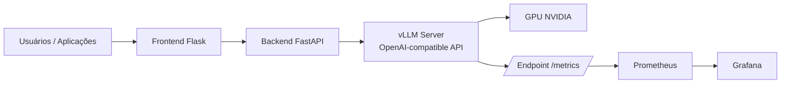
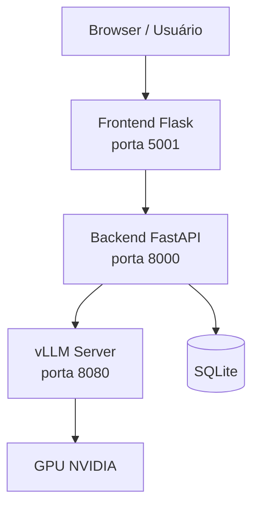

# Hospedagem de Alto Desempenho de Modelos LLM usando vLLM

Este repositório reúne materiais, laboratórios e protótipos para estudar e implementar **hospedagem de alto desempenho de modelos LLM com vLLM**, com foco em inferência escalável, API compatível com OpenAI, uso de GPU, monitoramento com Prometheus/Grafana e integração com aplicações web.

O conteúdo está organizado em três frentes principais:

1. **Laboratório didático de vLLM**: exercícios progressivos para compreender HuggingFace baseline, vLLM, KV Cache, PagedAttention, API server, carga multiusuário, tuning e dashboard.
2. **Protótipo de chatbot com vLLM**: aplicação containerizada com frontend Flask, backend FastAPI e servidor LLM baseado em vLLM.
3. **Stack de observabilidade**: ambiente com vLLM, Prometheus e Grafana para coleta e análise de métricas de inferência.

---

## Objetivo do material

O objetivo é demonstrar como sair de uma execução simples de modelo LLM para uma arquitetura de **serving de LLMs mais próxima de produção**, considerando:

- execução eficiente em GPU;
- atendimento de múltiplos usuários;
- redução de gargalos de memória;
- uso de APIs compatíveis com OpenAI;
- coleta de métricas de desempenho;
- análise de latência, throughput e uso de KV cache;
- integração com aplicações reais de chat;
- preparação para cenários de RAG, APIs institucionais e serviços multiusuário.

---

## Visão geral da arquitetura

Em uma arquitetura de alto desempenho com vLLM, o modelo deixa de ser chamado diretamente por scripts locais e passa a ser servido por um mecanismo especializado de inferência.



Essa separação permite que a aplicação de negócio, o servidor de inferência e a camada de observabilidade evoluam de forma independente.

---

## Estrutura do repositório

```text
vLLM-main/
├── Apresentacao_vLLM_Alto_Desempenho.pdf
├── lab/
│   └── code/
│       ├── README.md
│       ├── verify_env.py
│       ├── task_1.py
│       ├── task_2.py
│       ├── task_3.py
│       ├── task_4.py
│       ├── task_5.py
│       ├── task_6.py
│       ├── task_7.py
│       └── task_8.py
├── vllm-server-api-chat/
│   ├── README.md
│   ├── docker-compose.yml
│   ├── Dockerfile.backend
│   ├── Dockerfile.frontend
│   ├── start-all.sh
│   ├── start-clean.sh
│   ├── start-vllm-server.sh
│   ├── docs/
│   │   ├── report.md
│   │   └── erro_acesso_gpu.md
│   └── metrics/
│       ├── logs.txt
│       └── analise.md
└── vllm-server-prometheus-grafana/
    ├── README.md
    ├── docker-compose.yml
    ├── main.py
    ├── teste.py
    ├── teste.sh
    ├── painel_grafana.md
    ├── prometheus/
    │   └── prometheus.yml
    └── grafana/
        └── provisioning/
```

---

## 1. Laboratório didático: `lab/code`

A pasta `lab/code` contém um laboratório progressivo para compreender os principais conceitos de inferência com vLLM.

### Modelo usado no laboratório

O laboratório utiliza o modelo:

```text
HuggingFaceTB/SmolLM-135M
```

Esse modelo é pequeno e adequado para fins didáticos, permitindo executar experimentos mesmo em ambientes com recursos limitados.

### Tarefas do laboratório

| Tarefa | Arquivo | Objetivo principal |
|---|---|---|
| Setup | `verify_env.py` | Verificar ambiente, dependências e disponibilidade do modelo |
| Task 1 | `task_1.py` | Medir uma linha de base com HuggingFace Transformers |
| Task 2 | `task_2.py` | Executar inferência offline com vLLM e comparar desempenho |
| Task 3 | `task_3.py` | Simular o problema de fragmentação do KV cache |
| Task 4 | `task_4.py` | Demonstrar a ideia do PagedAttention |
| Task 5 | `task_5.py` | Subir uma API vLLM compatível com OpenAI |
| Task 6 | `task_6.py` | Testar múltiplos usuários concorrentes |
| Task 7 | `task_7.py` | Experimentar parâmetros de tuning para produção |
| Task 8 | `task_8.py` | Criar um dashboard de monitoramento com Gradio |

### Conceitos abordados

O laboratório cobre os seguintes conceitos:

- diferença entre inferência local simples e serving especializado;
- comparação entre HuggingFace Transformers e vLLM;
- impacto do KV cache na memória;
- funcionamento conceitual do PagedAttention;
- exposição de modelos via API compatível com OpenAI;
- testes de carga com múltiplas requisições;
- tuning de parâmetros de inferência;
- criação de dashboard para acompanhamento de métricas.

---

## 2. Protótipo de aplicação de chat: `vllm-server-api-chat`

A pasta `vllm-server-api-chat` contém uma solução de IA Generativa com arquitetura em containers. A aplicação possui três componentes principais:

1. **Frontend Flask**: interface web para login, dashboard e interação com o chat.
2. **Backend FastAPI**: API intermediária responsável por autenticação, persistência e integração com o servidor LLM.
3. **Servidor vLLM**: servidor de inferência executando um modelo LLM com API compatível com OpenAI.

### Arquitetura do protótipo



### Modelo configurado

O protótipo usa como referência o modelo:

```text
Qwen/Qwen3-4B-Instruct-2507-FP8
```

Esse modelo é configurado no `docker-compose.yml` e no script `start-vllm-server.sh`.

### Comandos principais

Iniciar apenas o servidor vLLM:

```bash
./start-vllm-server.sh
```

Iniciar toda a solução:

```bash
./start-all.sh
```

Subir backend e frontend via Docker Compose:

```bash
docker compose up -d
```

Verificar os containers:

```bash
docker compose ps -a
```

Acompanhar logs:

```bash
docker compose logs -f
```

Testar se o backend consegue acessar o servidor vLLM:

```bash
docker compose exec backend curl http://host.docker.internal:8080/v1/models
```

### Endpoints e portas

| Componente | Porta | Finalidade |
|---|---:|---|
| Frontend Flask | `5001` | Interface web do usuário |
| Backend FastAPI | `8000` | API da aplicação |
| vLLM Server | `8080` | API OpenAI-like para inferência |
| SQLite | arquivo local | Persistência de usuários e chats |

### Pontos importantes da implementação

- O backend usa variável `LLM_SERVER_BASE_URL` apontando para `http://host.docker.internal:8080/v1`.
- A integração com o vLLM segue o padrão OpenAI-like.
- O frontend se comunica com o backend, e não diretamente com o vLLM.
- O servidor vLLM roda como container separado, usando GPU NVIDIA.
- O projeto inclui documentação de troubleshooting para problemas de acesso à GPU.

---

## 3. Stack de monitoramento: `vllm-server-prometheus-grafana`

A pasta `vllm-server-prometheus-grafana` contém uma stack para executar o vLLM com monitoramento via Prometheus e Grafana.

### Componentes

| Componente | Porta | Função |
|---|---:|---|
| vLLM | `8000` | Servidor OpenAI-like para inferência |
| Prometheus | `9090` | Coleta e consulta de métricas |
| Grafana | `3000` | Dashboards e visualização |

### Modelo padrão

A stack usa como modelo padrão:

```text
Qwen/Qwen2.5-0.5B-Instruct
```

Esse modelo pode ser alterado por variável de ambiente `MODEL_ID`.

### Subir a stack

```bash
docker compose up -d
```

Acompanhar logs do vLLM:

```bash
docker compose logs -f vllm
```

Listar modelos carregados:

```bash
curl -s http://localhost:8000/v1/models | jq
```

Testar chat completion:

```bash
curl http://localhost:8000/v1/chat/completions \
  -H "Content-Type: application/json" \
  -H "Authorization: Bearer local-dev-key" \
  -d '{
    "model": "Qwen/Qwen2.5-0.5B-Instruct",
    "messages": [
      {"role": "system", "content": "Você é um assistente útil."},
      {"role": "user", "content": "Explique o que é IA em poucas frases."}
    ],
    "max_tokens": 300,
    "temperature": 0.7
  }'
```

Verificar métricas:

```bash
curl -s http://localhost:8000/metrics | head -n 30
```

### Consultas e painéis sugeridos no Grafana

O arquivo `painel_grafana.md` inclui um dashboard JSON com painéis para:

- latência p95 fim-a-fim;
- TTFT p95;
- throughput em tokens/s;
- requisições em execução e em espera;
- pressão do KV cache na GPU.

Esses painéis ajudam a identificar gargalos de desempenho e orientar decisões de tuning.

---

## Conceitos técnicos principais

### vLLM

O vLLM é um mecanismo de serving de LLMs voltado para alta performance. Ele permite disponibilizar modelos por meio de uma API compatível com OpenAI e utiliza técnicas como:

- **PagedAttention**;
- **continuous batching**;
- gerenciamento eficiente de KV cache;
- suporte a múltiplas GPUs;
- métricas de servidor;
- integração com ferramentas de observabilidade.

### PagedAttention

O PagedAttention é uma técnica que trata o KV cache de forma semelhante à paginação de memória em sistemas operacionais. Em vez de alocar grandes blocos contíguos por requisição, o cache é dividido em blocos menores, reduzindo desperdício e fragmentação.

### Continuous batching

O continuous batching permite que o vLLM agrupe dinamicamente requisições em diferentes estágios de geração. Assim, a GPU permanece mais ocupada e o sistema consegue melhorar o throughput em cenários multiusuário.

### KV Cache

O KV cache armazena os vetores de chave e valor usados pelo mecanismo de atenção durante a geração autoregressiva. Ele cresce com o tamanho do prompt, com o número de tokens gerados e com a quantidade de requisições simultâneas.

Por isso, controlar o KV cache é essencial para evitar:

- estouro de memória GPU;
- degradação de latência;
- queda de throughput;
- instabilidade em carga.

---

## Métricas importantes para avaliação

A solução destaca a importância de medir desempenho com métricas objetivas.

| Métrica | Significado |
|---|---|
| TTFT | Tempo até o primeiro token |
| ITL | Latência entre tokens gerados |
| E2E Latency | Latência total da requisição |
| Tokens/s | Throughput de geração |
| Prompt tokens/s | Throughput na etapa de prefill |
| Running requests | Requisições em execução |
| Waiting requests | Requisições aguardando na fila |
| GPU KV cache usage | Pressão de uso do KV cache em VRAM |
| VRAM usage | Uso total da memória da GPU |

---

## Exemplo de análise de métricas

O arquivo `vllm-server-api-chat/metrics/analise.md` apresenta uma análise de métricas Prometheus de um servidor vLLM em execução.

Entre os pontos analisados estão:

- ambiente Python do container;
- modelo carregado;
- quantidade de requisições bem-sucedidas;
- total de tokens de prompt;
- total de tokens gerados;
- TTFT médio;
- tempo médio por token de saída;
- latência fim-a-fim;
- throughput aproximado;
- uso de memória e estabilidade do servidor.

Esse tipo de análise é importante para transformar testes técnicos em evidências de engenharia.

---

## Parâmetros importantes de configuração do vLLM

Alguns parâmetros aparecem nos scripts e no `docker-compose.yml` e são centrais para tuning:

| Parâmetro | Finalidade |
|---|---|
| `--model` | Define o modelo carregado pelo vLLM |
| `--host` | Interface de rede do servidor |
| `--port` | Porta do servidor vLLM |
| `--api-key` | Token para autenticação das chamadas |
| `--gpu-memory-utilization` | Fração da VRAM usada pelo vLLM |
| `--max-model-len` | Comprimento máximo do contexto |
| `--max-num-seqs` | Número máximo de sequências simultâneas |
| `--dtype` | Tipo numérico usado na inferência |
| `--enforce-eager` | Força execução eager, útil em alguns cenários de compatibilidade |
| `--trust-remote-code` | Permite carregar código remoto do modelo, quando necessário |

---

## Pré-requisitos

Para executar os protótipos com GPU, recomenda-se:

- Linux, preferencialmente Ubuntu;
- Docker e Docker Compose;
- GPU NVIDIA compatível;
- NVIDIA Driver instalado;
- NVIDIA Container Toolkit;
- acesso à internet para baixar modelos;
- token Hugging Face, se o modelo exigir autenticação;
- espaço em disco para cache de modelos.

Validação rápida da GPU no Docker:

```bash
docker run --rm --gpus all nvidia/cuda:12.2.0-base-ubuntu22.04 nvidia-smi
```

---

## Fluxo recomendado de estudo

Uma sequência sugerida para usar este material é:

1. Ler a apresentação `Apresentacao_vLLM_Alto_Desempenho.pdf`.
2. Executar o laboratório em `lab/code`, começando por `verify_env.py`.
3. Rodar as tarefas `task_1.py` a `task_8.py`.
4. Subir o protótipo `vllm-server-api-chat`.
5. Testar a integração entre frontend, backend e vLLM.
6. Subir a stack `vllm-server-prometheus-grafana`.
7. Coletar métricas via `/metrics`.
8. Criar ou importar dashboards no Grafana.
9. Executar testes de carga.
10. Documentar latência, throughput, uso de VRAM e gargalos encontrados.

---

## Recomendações de boas práticas

- Comece com modelos pequenos para validar infraestrutura.
- Meça latência e throughput antes de trocar o modelo.
- Use percentis, como p50, p95 e p99, em vez de apenas média.
- Monitore GPU, VRAM, fila e KV cache.
- Defina limites de contexto e tokens de saída.
- Separe workloads interativos de workloads batch.
- Evite expor o vLLM diretamente à internet sem gateway, autenticação e rate limit.
- Use Prometheus e Grafana para observabilidade contínua.
- Documente configurações, modelo usado, versão da imagem Docker e parâmetros de inferência.
- Faça testes de carga antes de considerar o ambiente pronto para produção.

---

## Cenários de uso

Este material pode ser usado em:

- aulas sobre LLM Serving;
- disciplinas de IA Generativa;
- laboratórios de infraestrutura para IA;
- protótipos institucionais de chatbot;
- experimentos com APIs compatíveis com OpenAI;
- avaliação de modelos open source;
- estudos de desempenho com GPU;
- preparação para arquiteturas RAG em produção.

---

## Conclusão

O arquivo `.zip` apresenta um conjunto prático e didático para compreender a hospedagem de modelos LLM com vLLM em cenários de alto desempenho. O material cobre desde conceitos fundamentais, como KV cache e PagedAttention, até protótipos completos com aplicação web, backend, servidor vLLM, métricas Prometheus e dashboards Grafana.

A principal mensagem técnica do conteúdo é que **servir LLMs em produção não é apenas executar um modelo**, mas organizar uma arquitetura capaz de lidar com concorrência, uso eficiente de GPU, observabilidade, tuning e análise contínua de desempenho.
